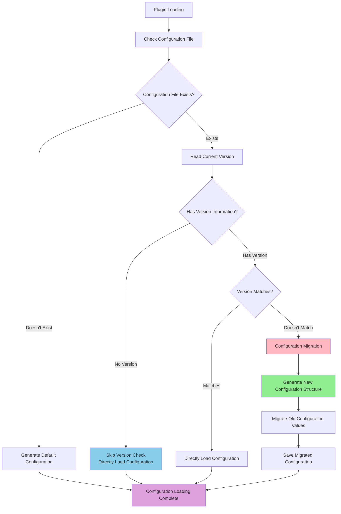

# ⚙️ Plugin Configuration Complete Guide

This document will comprehensively guide you on how to **define configuration** for your plugin and **access configuration** in components, helping you build a robust, standardized, and self-documenting configuration system.

> **🚨 Important Principle: Never manually create config.toml file at any time!**
>
> The system automatically generates configuration files based on the `config_schema` you define in code. Manually creating configuration files will break the automation process, causing issues like configuration inconsistency, missing comments and documentation.

## Configuration Version Management

### 🎯 Version Management Overview

The plugin system provides a powerful **configuration version management mechanism** that can automatically handle configuration file migration and updates during plugin upgrades, ensuring configuration structure always stays synchronized with code.

### 🔄 Configuration Version Management Workflow



### 📊 Version Management Strategy

#### 1. Configuration Version Definition

Define `config_version` in the `plugin` section of `config_schema`:

```python
config_schema = {
    "plugin": {
        "enabled": ConfigField(type=bool, default=False, description="Whether to enable plugin"),
        "config_version": ConfigField(type=str, default="1.2.0", description="Configuration file version"),
    },
    # Other configuration...
}
```

#### 2. Version Check Behavior

- **No Version Information** (`config_version` doesn't exist)
  - System will **skip version check**, directly load existing configuration
  - Suitable for compatibility handling of old version plugins
  - Log display: `Configuration file has no version information, skipping version check`

- **Has Version Information** (`config_version` field exists)
  - Compare current version with expected version
  - Automatically execute configuration migration when versions don't match
  - Directly load configuration when versions match

#### 3. Configuration Migration Process

When version mismatch is detected, the system will:

1. **Generate New Configuration Structure** - Generate new configuration structure based on latest `config_schema`
2. **Migrate Configuration Values** - Migrate values from old configuration file to new structure
3. **Handle New Fields** - New configuration items use default values
4. **Update Version Number** - `config_version` field automatically updated to latest version
5. **Save Configuration File** - Migrated configuration directly overwrites original file **(no backup kept)**

### 🔧 Practical Usage Example

#### Version Upgrade Scenario

Assume your plugin upgrades from v1.0 to v1.1, adding permission management functionality:

**Old Version Configuration (v1.0.0):**
```toml
[plugin]
enabled = true
config_version = "1.0.0"

[mute]
min_duration = 60
max_duration = 3600
```

**New Version Schema (v1.1.0):**
```python
config_schema = {
    "plugin": {
        "enabled": ConfigField(type=bool, default=False, description="Whether to enable plugin"),
        "config_version": ConfigField(type=str, default="1.1.0", description="Configuration file version"),
    },
    "mute": {
        "min_duration": ConfigField(type=int, default=60, description="Minimum mute duration (seconds)"),
        "max_duration": ConfigField(type=int, default=2592000, description="Maximum mute duration (seconds)"),
    },
    "permissions": {  # New configuration section
        "allowed_users": ConfigField(type=list, default=[], description="Allowed user list"),
        "allowed_groups": ConfigField(type=list, default=[], description="Allowed group list"),
    }
}
```

**Migrated Configuration (v1.1.0):**
```toml
[plugin]
enabled = true  # Keep original value
config_version = "1.1.0"  # Automatically updated

[mute]
min_duration = 60  # Keep original value
max_duration = 3600  # Keep original value

[permissions]  # New section, using default values
allowed_users = []
allowed_groups = []
```

### ⚠️ Important Notes

#### Version Number Management
- When you modify `config_schema`, **must synchronously update** `config_version`
- Please use semantic version numbers (e.g.: `1.0.0`, `1.1.0`, `2.0.0`)

## Configuration Definition

Configuration definition is completed in your plugin main class (inheriting from `BasePlugin`), mainly through two class attributes:

1.  `config_section_descriptions`: A dictionary used to describe each section (`[section]`) of the configuration file.
2.  `config_schema`: Core part, a nested dictionary used to define specific configuration items under each section.

### `ConfigField`: Foundation of Configuration Items

Each configuration item is defined through a `ConfigField` object.

```python
from dataclasses import dataclass
from src.plugin_system.base.config_types import ConfigField

@dataclass
class ConfigField:
    """Configuration field definition"""
    type: type          # Field type (e.g., str, int, float, bool, list)
    default: Any        # Default value
    description: str    # Field description (will be generated as comments in configuration file)
    example: Optional[str] = None       # Example value (optional)
    required: bool = False              # Whether required (optional, mainly for documentation hints)
    choices: Optional[List[Any]] = None # Optional value list (optional)
```

### Configuration Example

Let's take a feature-rich `MutePlugin` as an example to see how to define its configuration.

```python
# src/plugins/built_in/mute_plugin/plugin.py

from src.plugin_system import BasePlugin, register_plugin, ConfigField
from typing import List, Tuple, Type

@register_plugin
class MutePlugin(BasePlugin):
    """Mute Plugin"""

    # Here is basic plugin information, omitted

    # Step 1: Define configuration section descriptions
    config_section_descriptions = {
        "plugin": "Plugin enable configuration",
        "components": "Component enable control",
        "mute": "Core mute functionality configuration",
        "smart_mute": "Smart mute Action exclusive configuration",
        "logging": "Logging related configuration"
    }

    # Step 2: Use ConfigField to define detailed configuration Schema
    config_schema = {
        "plugin": {
            "enabled": ConfigField(type=bool, default=False, description="Whether to enable plugin")
        },
        "components": {
            "enable_smart_mute": ConfigField(type=bool, default=True, description="Whether to enable smart mute Action"),
            "enable_mute_command": ConfigField(type=bool, default=False, description="Whether to enable mute command Command")
        },
        "mute": {
            "min_duration": ConfigField(type=int, default=60, description="Minimum mute duration (seconds)"),
            "max_duration": ConfigField(type=int, default=2592000, description="Maximum mute duration (seconds), default 30 days"),
            "templates": ConfigField(
                type=list,
                default=["Okay, muted {target} for {duration}, reason: {reason}", "Received, executing mute on {target} for {duration}"],
                description="Random message templates sent after successful mute"
            )
        },
        "smart_mute": {
            "keyword_sensitivity": ConfigField(
                type=str,
                default="normal",
                description="Keyword activation sensitivity",
                choices=["low", "normal", "high"] # Define optional values
            ),
        },
        "logging": {
            "level": ConfigField(
                type=str,
                default="INFO",
                description="Logging level",
                choices=["DEBUG", "INFO", "WARNING", "ERROR"]
            ),
            "prefix": ConfigField(type=str, default="[MutePlugin]", description="Logging prefix", example="[MyMutePlugin]")
        }
    }

    # Here are plugin methods, omitted
```

When `mute_plugin` is first loaded and `config.toml` doesn't exist in its directory, the system automatically creates the following file:

```toml
# mute_plugin - Automatically generated configuration file
# Group chat mute management plugin, providing smart mute functionality

# Plugin enable configuration
[plugin]

# Whether to enable plugin
enabled = false


# Component enable control
[components]

# Whether to enable smart mute Action
enable_smart_mute = true

# Whether to enable mute command Command
enable_mute_command = false


# Core mute functionality configuration
[mute]

# Minimum mute duration (seconds)
min_duration = 60

# Maximum mute duration (seconds), default 30 days
max_duration = 2592000

# Random message templates sent after successful mute
templates = ["Okay, muted {target} for {duration}, reason: {reason}", "Received, executing mute on {target} for {duration}"]


# Smart mute Action exclusive configuration
[smart_mute]

# Keyword activation sensitivity
# Optional values: low, normal, high
keyword_sensitivity = "normal"


# Logging related configuration
[logging]

# Logging level
# Optional values: DEBUG, INFO, WARNING, ERROR
level = "INFO"

# Logging prefix
# Example: [MyMutePlugin]
prefix = "[MutePlugin]"
```

---

## Configuration Access

If you want to access configuration in your components, you can access configuration through the component's built-in `get_config()` method.

Its parameter is a namespace-style string. Taking the above `MutePlugin` as an example, you can access configuration like this:

```python
enable_smart_mute = self.get_config("components.enable_smart_mute", True)
```

If trying to access a non-existent configuration item, the system will automatically return the default value (what you passed) or `None`.

---

## Best Practices and Notes

**🚨 Core Principle: Never manually create config.toml file!**

1.  **🔥 Never Manually Create Configuration Files**: **Never manually create `config.toml` file at any time**! Must let the system automatically generate it by defining `config_schema` in `plugin.py`.
    - ❌ **Forbidden**: `touch config.toml`, manually writing configuration files
    - ✅ **Correct**: Define `config_schema`, start plugin, let system automatically generate

2.  **Schema First**: All configuration items must be declared in `config_schema`, including type, default value, and description.

3.  **Clear Description**: Write clear, accurate descriptions for each `ConfigField` and `config_section_descriptions`. This will directly become part of your plugin documentation.

4.  **Configuration Files Only for Modification**: Automatically generated `config.toml` files should only be **modified** by users, not created from scratch.